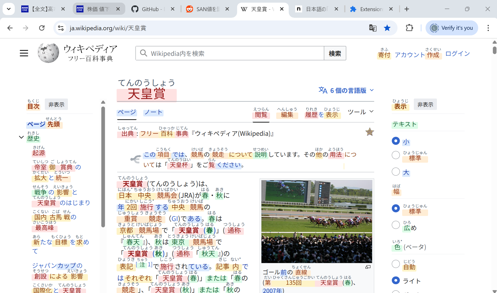
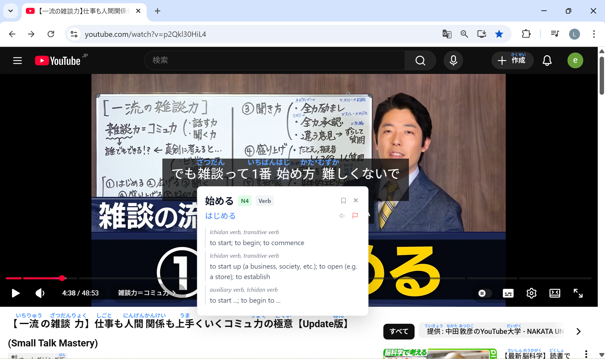
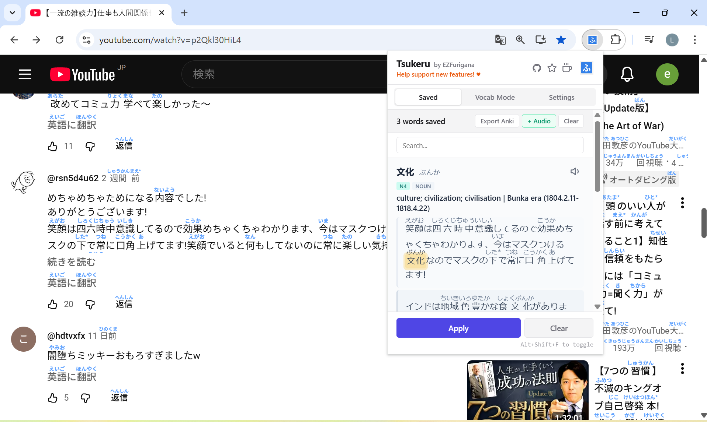
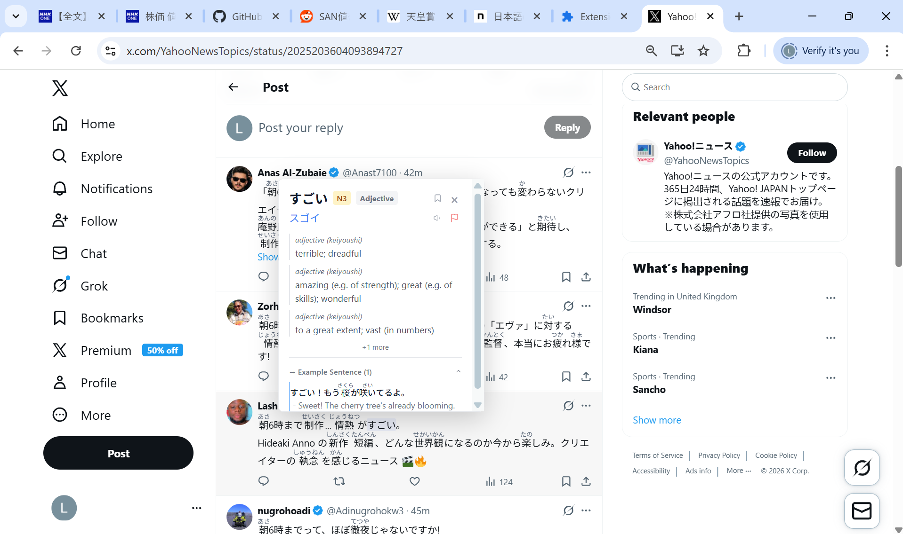

<div align="center">
  
  <h1>Tsukeru – Furigana Converter</h1>
  <p>Chrome/Edge + Firefox Extension</p>
  <a href="https://www.buymeacoffee.com/riamua" target="_blank">
    
  </a>
</div>

Tsukeru is a furigana extension for Chrome and Firefox. It injects hiragana readings above kanji on any Japanese webpage, with offline dictionary tooltips, vocabulary saving, and JLPT-level filtering. Powered by the open-source [EZFurigana](https://www.ezfurigana.com) API.



---

## Features

### 🎌 YouTube & Dynamic Site Support

Custom CSS overrides and Intersection Observers ensure furigana renders correctly on heavily structured sites like YouTube — no title clipping, no layout breaks.




### 🐦 Social Media

Read Japanese tweets directly in your feed.



### 🔤 Offline Dictionary Tooltips & JLPT Filtering

Click any word for instant definitions, kanji breakdowns, and example sentences. In Settings, filter out N5/N4 kana readings to reduce visual clutter on pages you're already comfortable with.

### 💾 Vocabulary Builder & Anki Export

Save words directly from the tooltip into a built-in vocabulary list. Export to a `.zip` containing CSVs and native TTS audio — formatted for one-click Anki import.

---

## How It Works

Clicking "Apply Furigana" extracts visible Japanese text from the active tab. The text is sent to the EZFurigana backend, which returns ruby-annotated HTML. The extension sanitizes and injects the annotations back into the page.

You can also toggle furigana on/off with a keyboard shortcut:
**`Ctrl+Shift+Z`** on Chrome/Edge or **`Ctrl+Shift+F`** on Firefox (Mac: `⌘+Shift+Z` or `⌘+Shift+F`).

Nothing runs in the background. No text is sent unless you trigger it.

---

## Architecture

Pure Vanilla MV3 with native ES Modules — no bundler, no build step. The source is exactly what runs in the browser, making it straightforward to read and contribute to.

---

## Privacy

Tsukeru does not collect, track, or store user data.

Text is sent to the EZFurigana backend only when you explicitly apply furigana. It is processed server-side to generate readings and discarded immediately after. No text is logged, retained, or associated with a user.

No personal information, browsing history, or page content is collected.

For more details, see the full [privacy policy](https://www.ezfurigana.com/privacy).

---

## Extension Folders

- `chrome`: MV3 build for Chrome and Microsoft Edge
- `firefox`: MV3 build for Firefox

## Locale Validation

Run locale validation before every unpacked load/reload:

```bash
node scripts/validate-locales.js
```

The validator checks:
- locale JSON syntax
- placeholder syntax rules
- key parity across `chrome`/`firefox` and `en`/`ja`
- referenced i18n keys from JS/HTML/manifest tokens

If it fails, fix missing/extra keys or malformed placeholders before loading the extension.

---

## Permissions

The extension uses the strictest minimum permissions across all browsers:

- **activeTab & scripting**
  Injects furigana logic only after explicit user action on the active tab. No background scanning occurs.
- **storage**
  Stores user settings and optional vocabulary data locally.
- **contextMenus**
  Provides Apply and Clear actions via right-click.
- **host_permissions**
  Network access is hard-restricted to `https://www.ezfurigana.com/*`. No wildcard `<all_urls>` access is requested.

---

## Submission Notes

- Manual activation only. The extension does not run automatically on pages.
- No page content is processed unless the user clicks "Apply Furigana" (or uses the keyboard shortcut).
- No analytics, trackers, or third-party scripts are included.

---

## License

MIT
