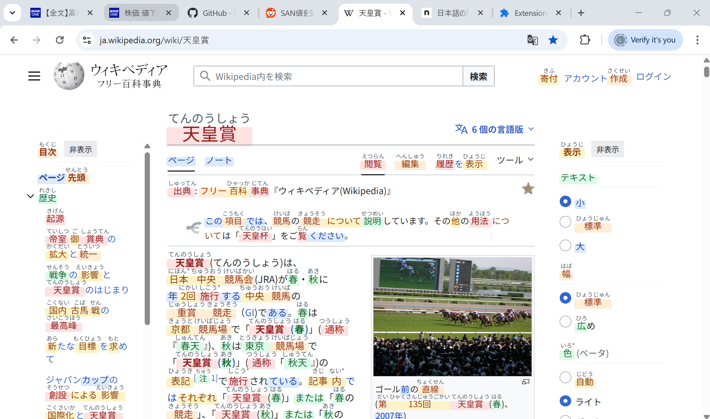
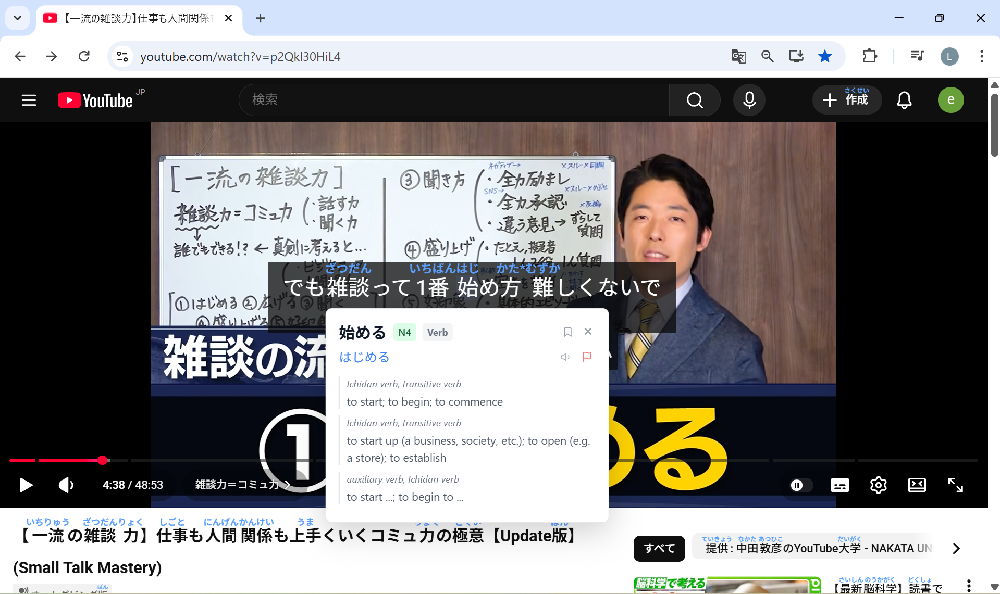
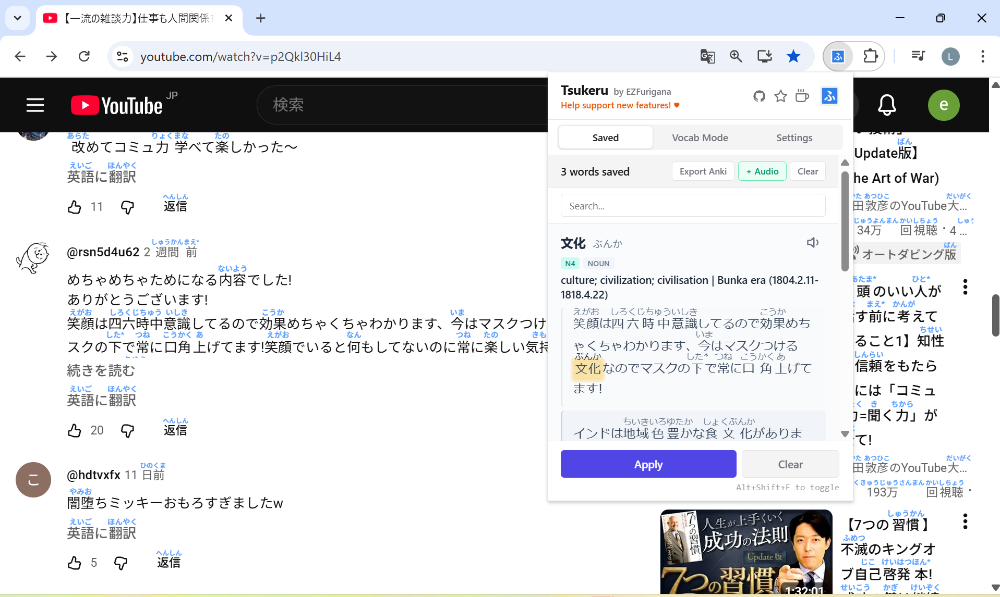
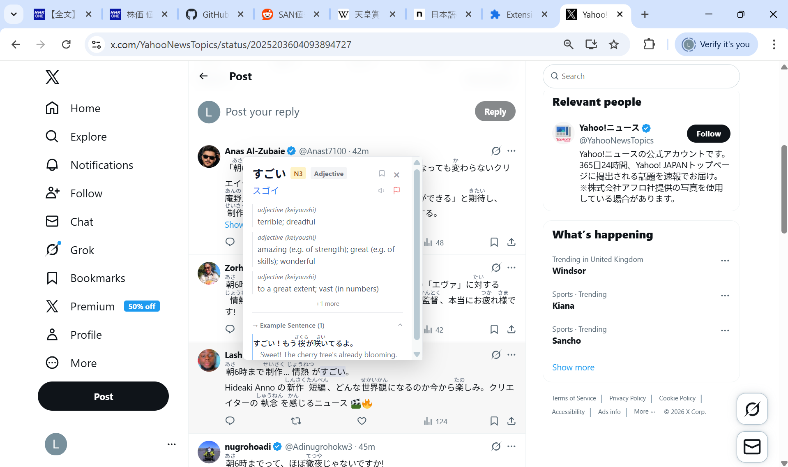

<div align="center">
  
  <h1>Tsukeru – Furigana Converter</h1>
  <p>Chrome/Edge + Firefox Extension</p>
  <a href="https://ko-fi.com/riamua" target="_blank">
    
  </a>
</div>

Tsukeru is a furigana extension for Chrome and Firefox. It injects hiragana readings above kanji on any Japanese webpage, with offline dictionary tooltips, vocabulary saving, and JLPT-level filtering. Powered by the open-source [EZFurigana](https://www.ezfurigana.com) API.



---

## Features

### 🎌 YouTube & Dynamic Site Support

Custom CSS overrides and Intersection Observers ensure furigana renders correctly on heavily structured sites like YouTube — no title clipping, no layout breaks.




### 🐦 Social Media

Read Japanese tweets directly in your feed.



### 🔤 Offline Dictionary Tooltips & JLPT Filtering

Click any word for instant definitions, kanji breakdowns, and example sentences. In Settings, filter out N5/N4 kana readings to reduce visual clutter on pages you're already comfortable with.

### 💾 Vocabulary Builder & Anki Export

Save words directly from the tooltip into a built-in vocabulary list. Export to a `.zip` containing CSVs and native TTS audio — formatted for one-click Anki import.

---

## How It Works

Clicking "Apply Furigana" extracts visible Japanese text from the active tab. The text is sent to the EZFurigana backend, which returns ruby-annotated HTML. The extension sanitizes and injects the annotations back into the page.

You can also toggle furigana on/off with a keyboard shortcut:
**`Ctrl+Shift+Z`** on Chrome/Edge or **`Ctrl+Shift+F`** on Firefox (Mac: `⌘+Shift+Z` or `⌘+Shift+F`).

Nothing runs in the background. No text is sent unless you trigger it.

---

## Local HTML Files

Chrome, Microsoft Edge, and Firefox can apply furigana to saved local HTML files opened with `file://`.

On Chrome and Edge, open the extension details page and enable **Allow access to file URLs** for Tsukeru before using that flow. Firefox supports local HTML files without a separate file-URL toggle.

For privacy, Tsukeru does not send local filesystem paths to the furigana backend. Saved vocabulary from local files also stores a redacted local-file source label instead of the full `file://` path.

---

## Architecture

Pure Vanilla MV3 with native ES Modules — no bundler, no build step. The source is exactly what runs in the browser, making it straightforward to read and contribute to.

---

## Privacy

Tsukeru does not collect, track, or store user data.

Text is sent to the EZFurigana backend only when you explicitly apply furigana. It is processed server-side to generate readings and discarded immediately after. No text is logged, retained, or associated with a user.

No personal information, browsing history, or page content is collected.

For more details, see the full [privacy policy](https://www.ezfurigana.com/privacy).

---

## Extension Folders

- `chrome`: MV3 build for Chrome and Microsoft Edge
- `firefox`: MV3 build for Firefox

## Staging / Debug Builds

Generate local staging extension folders that send backend requests to `https://staging.ezfurigana.com` instead of production. Source files remain untouched.

```bash
node scripts/build-staging-extensions.js
```

This creates `dist/chrome-staging/` and `dist/firefox-staging/` (gitignored).

To load:

- **Chrome/Edge**: Open `chrome://extensions`, enable Developer mode, click **Load unpacked**, select `dist/chrome-staging/`.
- **Firefox**: Open `about:debugging#/runtime/this-firefox`, click **Load Temporary Add-on**, select `dist/firefox-staging/manifest.json`.

Verify requests target staging by checking the Network panel or service worker logs.

### GitHub-Current Staging Build

Generate staging extension folders from the GitHub-current version (`origin/main`), not from your local working tree. This is useful for testing the current published code against the staging backend.

```bash
$env:TSUKERU_STAGING_BASIC_USER = "liam"
$env:TSUKERU_STAGING_BASIC_PASS = "your-staging-password"
node scripts/build-github-staging-extensions.js
```

This creates `dist/chrome-staging-github/` and `dist/firefox-staging-github/` (gitignored). These come from `origin/main`, not your local files.

To load:

- **Chrome/Edge**: Open `chrome://extensions`, enable Developer mode, click **Load unpacked**, select `dist/chrome-staging-github/`.
- **Firefox**: Open `about:debugging#/runtime/this-firefox`, click **Load Temporary Add-on**, select `dist/firefox-staging-github/manifest.json`.

To override the git ref, set `TSUKERU_GITHUB_STAGING_REF` (e.g., `origin/develop`).

## Locale Validation

Run locale validation before every unpacked load/reload:

```bash
node scripts/validate-locales.js
```

The validator checks:
- locale JSON syntax
- placeholder syntax rules
- key parity across `chrome`/`firefox` and `en`/`ja`
- referenced i18n keys from JS/HTML/manifest tokens

If it fails, fix missing/extra keys or malformed placeholders before loading the extension.

---

## Permissions

The extension uses the strictest minimum permissions across all browsers:

- **activeTab & scripting**
  Injects furigana logic only after explicit user action on the active tab. No background scanning occurs.
  This also covers saved local HTML files. Chrome/Edge require browser-level file URL access to be enabled; Firefox does not use a separate toggle.
- **storage**
  Stores user settings and optional vocabulary data locally.
- **contextMenus**
  Provides Apply and Clear actions via right-click.
- **host_permissions**
  Network access is hard-restricted to `https://www.ezfurigana.com/*`. No wildcard `<all_urls>` access is requested.

---

## Submission Notes

- Manual activation only. The extension does not run automatically on pages.
- No page content is processed unless the user clicks "Apply Furigana" (or uses the keyboard shortcut).
- No analytics, trackers, or third-party scripts are included.

---

## License

MIT
